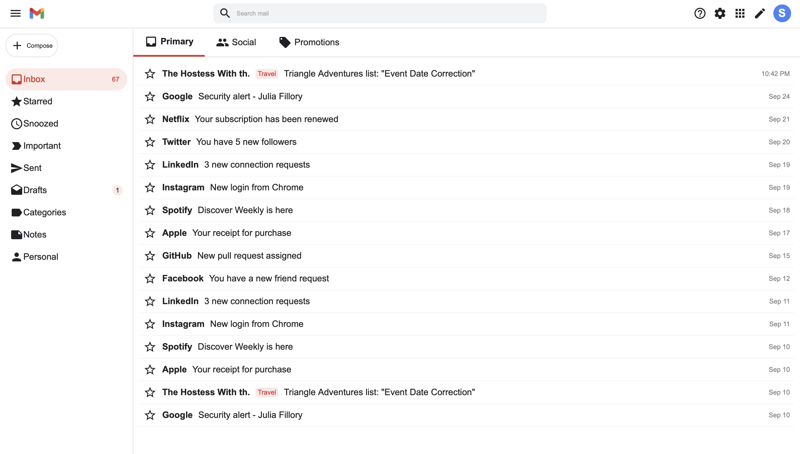

# 📧 Gmail-Style UI Clone

A simple **Gmail-inspired User Interface** created using **only HTML and CSS**.  
This project is a front-end design clone that visually replicates Gmail's clean and modern layout — without using JavaScript or any frameworks.

---

## ✨ Features

- 📩 **Clean Gmail-like Layout**
- 🎨 Modern and Minimal UI Design
- 🖌️ Pure HTML & CSS — No frameworks or libraries used
- 📱 Responsive design (works on different screen sizes)
- 🔍 Search bar styled like Gmail
- 📂 Sidebar menu with icons
- 🧑 Profile avatar placeholder

---

## 📷 Screenshots

### Main Interface

---

## 🛠️ Technologies Used

- **HTML5**
- **CSS3** (Flexbox, Grid, Shadows, etc.)

---

## 📂 Folder Structure

Gmail-UI-Clone/
├── index.html
├── style.css
├── gmail.jpeg
└── README.md
